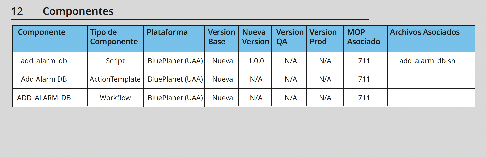

# Guía para la incorporación al registro de componentes

Ahora el documento MOP requerido para la solicitud de instalación de componentes, tanto en
ambiente de QA como en ambiente de producción, va a incorporar una nueva sección que deberá
llenar el solicitante del cambio.
Esta nueva sección tiene el objetivo de registrar los componentes y archivos que están siendo
modificados con el cambio, para poder hacer un seguimiento de los cambios y la evolución de los
mismos.

## Campos Solicitados:
En el mop se van a solicitar los siguientes campos para ser llenados de acuerdo a los componentes y entregables afectados con el cambio.

### Componente:
El nombre del componente que se esta modificando en este cambio.

### Tipo Componente:
El tipo de componente que se esta modificando, pudiendo ser una API, script, configuración, pantalla, flujo, plataforma, aplicacion, etc.

### Plataforma:
La plataforma a la cual pertenece el componente a modificar, ya sea Service Now, APIM, Blue Planet BPI, Blue Planet UAA, etc.

### Version Base:
La versión que se toma como base para realizar la modificación, pudiendo ser nueva; también se puede indicar si es desconocida y hay que revisar a futuro.

### Nueva Version:
La versión del componente que se va a instalar. Este número de versión es determinado por los equipos de desarrollo en conjunto con el área funcional.

### Version QA:
Se debe ingresar la versión actual del componente que se encuentra instalado en ambiente de QA.

### Version Prod:
La versión del componente que se encuentra actualmente instalada en producción y la cual sera reemplazada por la nueva versión una vez instalada.

### Archivos Asociados:
En caso de que sea aplicable, se recomienda indicar qué archivos asociados al componente mencionado están siendo modificados, se refiere a la extension del archivo de despliegue (por ejemplo: .jar, .snapp, etc) o el nombre del archivo individual en el caso que solo sean unos pocos archivos (por ejemplo: .sh, .conf, etc).

## Ejemplo 1:
Vamos a pasar 5 APIs a QA en un documento MOP, donde dos de ellas son nuevas y las tres
restantes ya existen en ambiente de QA, como se vería esto en nuestro mop.

## Ejemplo 2:
Vamos a pasar 5 APIs a QA en un documento MOP, donde dos de ellas son nuevas y las tres
restantes ya existen en ambiente de QA, como se vería esto en nuestro mop.

## Ejemplo 3:
Vamos a pasar 5 APIs a QA en un documento MOP, donde dos de ellas son nuevas y las tres
restantes ya existen en ambiente de QA, como se vería esto en nuestro mop.

